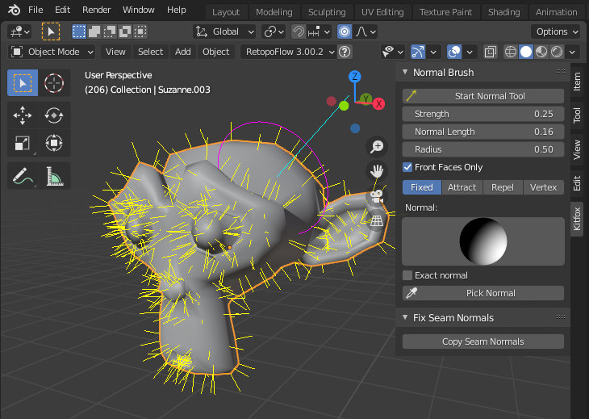

# Normal Brush for Blender

Adds a new control to Blender that allows you to adjust normals by stroking your model with a brush.

Once you install the tool, a new panel will be added to the 'N' menu on the right side of your viewport under the Kitfox tab.  

### Normal Brush Tool

[

The **Normal Brush** submenu contains controls for the brush.  To begin, select the object you want to adjust normals on and then click the **Start Normal Tool** button to activate the brush.  The normals of the object will then be shown overlaid on the mesh and you can click and drag with the brush to adjust them.

##### Strength
Adjust the strength of the brush stroke.

##### Pen Pressure
If checked, the strength of the brush stroke is multiplied by the pressure of your pen.

##### Normal Length
Change the display size normals are drawn in the overlay.

##### Radius
Radius of the normal brush.  You can also press the *[* and *]* keys to change the size.

##### Front Faces Only
If checked, your brush stroke will only affect faces facing the viewer.  Otherwise, all vertices within a sphere the size of the brush are affected.

##### Mode Buttons
- **Fixed** - Brush stroke will paint all normals to point in a single direction.
- **Comb** - Normals will point in the direction that you stroke the brush.
- **Attract** - Normals will point toward origin of selected target object.
- **Repel** - Normals will point away from origin of selected target object.
- **Vertex** - Paint normals to reflect the underlying geometry.  This effectively 'erases' your tweaks.

##### Normal
In **Fixed** mode, indicates the direction of the normal you are painting.  You can set it directly by typing in the normal or select *Exact Normal* to get a trackball you can use to adjust the normal.  You can also click the *Pick Normal* button to get an eyedropper to pick the normal from another piece of geometry in the scene.

##### Target
In **Attract** and **Repel** modes, indicates the target objects that normals will point toward/away from.

##### Undo/Redo
While the tool is running, you can use **CTRL-Z** to undo your most recent brush stroke and **CTRL-SHIFT-Z** to redo it.  The history is limited to 10 strokes.  Once you press **Enter** to finish editing normals, all your changes are added to Blender's undo queue as a group and you can no longer undo individual strokes.

### Fix Seam Normals Tool

Also included under the **Fix Seam Normals** menu is a control to automatically copy normals across seams.  Simply select two or more objects with edges that meet.  Then press the **Copy Seam Normals** button.  The normals from the active object will be copied to the other selected objects wherever the selected object' vertex is snapped to the same spot as the active object's vertex.

## Building

To build, execute the *makeDeploy.py* script in the root of the project.  It will create a directory called *deploy* that contains a zip file containing the addon.

## Installation

To install, start Blender and select Edit > Preferences from the menubar.  Select the Add-ons tab and then press the Install button.  Browse to the .zip file that you built and select it.  Finally, tick the checkbox next to Add Mesh: Normal Brush.

## Further Information

This addon is available from the Blender market:

https://blendermarket.com/products/normal-brush

A video giving a quick tour of the plugin is available here:

